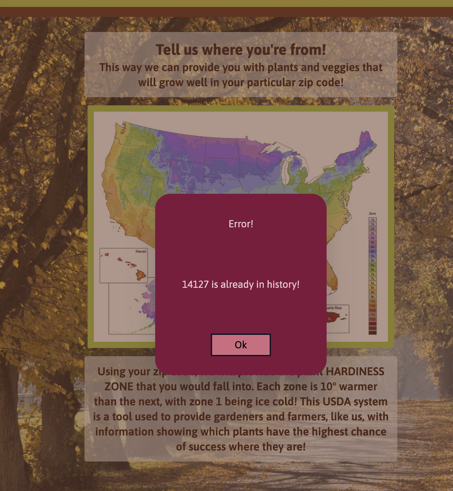

# Local Planting Planner

## Description

https://itsaboy.github.io/local-planting-planner/

This is a website using 2 APIs to find location and Hardiness Zone.  The site displays a map of all the zones, and produce/plants safe to plant in the user's area. There is an input for the user to type in their zip code which will determine which climate zone, the time of year to plant annuals and perrenials, and a sample of what plants are local.

## Usage
After reading about the Hardiness zone the zip code can be entered into the search box. If it has been entered before, a red box will appear saying it is in the history. If that is the case you can look for the location in the history. This has been stored in the local storage. After entering a zip code a second page will appear showing the zone number, when things should be planted and what plants are local to the area.

Page 1

Error Message

Page 2

## Credits

Developers:

--------------

Josiah Smith

Pam Willis

Zach Richardson

David Honeycutt

Katherine Vogler

---------------
## Deployment and GitHub

deployment:  https://itsaboy.github.io/local-planting-planner/

github: https://github.com/itsaboy/local-planting-planner.git

## License

MIT License

Copyright (c) [2023] [Pam Willis]

Permission is hereby granted, free of charge, to any person obtaining a copy
of this software and associated documentation files (the "Software"), to deal
in the Software without restriction, including without limitation the rights
to use, copy, modify, merge, publish, distribute, sublicense, and/or sell
copies of the Software, and to permit persons to whom the Software is
furnished to do so, subject to the following conditions:

The above copyright notice and this permission notice shall be included in all
copies or substantial portions of the Software.

THE SOFTWARE IS PROVIDED "AS IS", WITHOUT WARRANTY OF ANY KIND, EXPRESS OR
IMPLIED, INCLUDING BUT NOT LIMITED TO THE WARRANTIES OF MERCHANTABILITY,
FITNESS FOR A PARTICULAR PURPOSE AND NONINFRINGEMENT. IN NO EVENT SHALL THE
AUTHORS OR COPYRIGHT HOLDERS BE LIABLE FOR ANY CLAIM, DAMAGES OR OTHER
LIABILITY, WHETHER IN AN ACTION OF CONTRACT, TORT OR OTHERWISE, ARISING FROM,
OUT OF OR IN CONNECTION WITH THE SOFTWARE OR THE USE OR OTHER DEALINGS IN THE
SOFTWARE..

