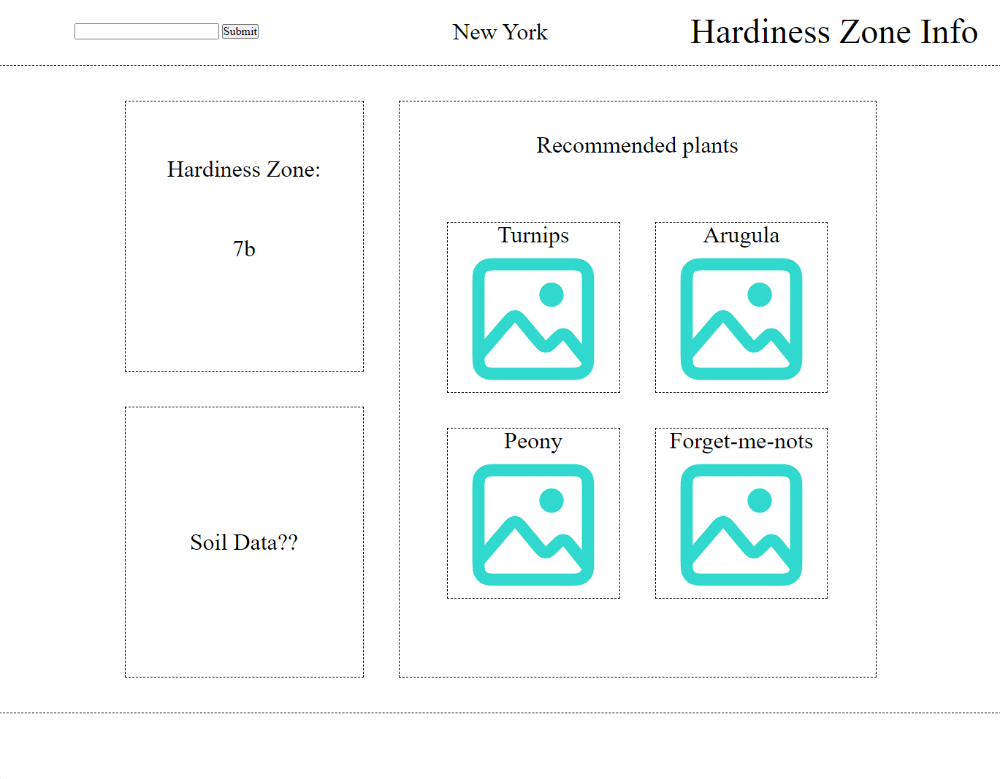

# local-planting-planner

## PROJECT DESCRIPTION

This is a website to display produce/plants safe to plant in the user's area. 
There is an input for the user to type in their state of residence which will determine which climate zone and the time of year to load results.

## USER STORY

AS A gardener/farmer

I WANT to see what kind of plants and produce I can plant in my area
 based on ground hardness, temperature, and time of year for my specific climate zone.

SO THAT I can effectively plan what to plant for the current season.

## USAGE

